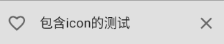

# Jectpack Compose

## 一、创建第一个 Compose 应用

### 1.1 定义

Jetpack Compose 是用于构建原生 Android 界面的新工具包。它可简化并加快 Android 上的界面开发，使用更少的代码、强大的工具和直观的 Kotlin API，快速打造生动而精彩的应用。

无需修改任何 XML 布局，也不需要使用布局编辑器。相反，只需调用可组合函数来定义所需的元素，Compose 编译器即会完成后面的所有工作。

### 1.2 创建

由于 Jetpack Compose 是基于 kotlin 开发的，所以需要使用 kotlin 编程。创建时需要选择“**Empty Compose Activity**”


一个新建的 Compose 应用内包含了一个 MainActivity.kt，以及 ui.theme 包内颜色、主题等配置文件


#### 1.2.1 MainActivity.kt

MainActivity 继承 ComponentActivity，而 ComponentActivity 又继承 Activity，所以 View 还是通 setContentView()加载。而 Compose 使用的是 setContent，该方法是 ComponentActivity 的一个扩展方法，其中 content 参数需要传入一个@Composable 注解的函数。在 setContent 内部，程序会去寻找 Activity 的根布局，若未找到则创建一个，然后将由@Composable 注解函数内的**声明式布局**创建。


Greeting 方法，其内容则是要创建的视图内容的具体声明描述了


DefaultPreview 方法，除了添加了 @Composable 注解外，还添加了 `@Preview`, @Preview 注解的方法可以在不运行 App 的情况下就可以确认布局的情况。


`@Preview`几个比较常用的参数：

- name: String 为该 preview 命名，该名称会在布局预览中显示
- showBackground: Boolean 是否显示背景
- backgroundColor: Long 背景颜色
- group: String 为该 Preview 设置 group 名字，可以在 UI 中以 group 为单位显示
- fontScale: Float 可以在预览中对字体放大，范围是从 0.01。- widthDp: Int: 在 Compose 中渲染的最大宽度，单位为 dp
- heightDp: Int 在 Compose 中渲染的最大高度，单位为 dp

原文：我们强烈建议您不要向生产函数（即使其不带参数）添加 `@Preview` 注释，而是编写一个封装函数并在其中添加 `@Preview` 注释。

#### 1.2.2 ui.theme

包内包含了 Color.kt、Shape.kt、Type.kt、Theme.kt，分别是颜色、形状、类型、主题的描述文件，可以理解为代替了传统 android 项目内 res 内的 xml 配置文件

#### 1.2.3 build.gradle

应用的最低 API 级别设置为 21 或更高级别，并且需要启用 jetpack compose，同时设置 kotlin 编译器插件的版本。

```gradle
android {
  defaultConfig {
    minSdk 21
  }

  buildFeatures {
    compose true
  }
  composeOptions {
    kotlinCompilerExtensionVersion compose_version
  }
}
```

添加 jetpack compose 工具包依赖项


布局预览界面显示：


手机运行结果：


## 二、可组合函数

Jetpack Compose 是围绕可组合函数构建的。这些函数可让您以程序化方式定义应用的界面，只需描述应用界面的外观并提供数据依赖项，而不必关注界面的构建过程（初始化元素，将其附加到父项等）。如需创建可组合函数，只需将 @Composable 注解添加到函数名称中即可，如 Greeting，DefaultPreview。

### 2.1 控件

#### 2.1.1 Text

相当于 Android 中的 TextView。源码如下，基于*BasicText*修改了样式等信息

```kotlin
fun Text(
    text: String,
    modifier: Modifier = Modifier,
    color: Color = Color.Unspecified,
    fontSize: TextUnit = TextUnit.Unspecified,
    fontStyle: FontStyle? = null,
    fontWeight: FontWeight? = null,
    fontFamily: FontFamily? = null,
    letterSpacing: TextUnit = TextUnit.Unspecified,
    textDecoration: TextDecoration? = null,
    textAlign: TextAlign? = null,
    lineHeight: TextUnit = TextUnit.Unspecified,
    overflow: TextOverflow = TextOverflow.Clip,
    softWrap: Boolean = true,
    maxLines: Int = Int.MAX\_VALUE,
    onTextLayout: (TextLayoutResult) -> Unit = {},
    style: TextStyle = *LocalTextStyle*.current
)
```

```kotlin
fun Text(
    text: AnnotatedString,
    // ......
)
```

- text - 要显示的内容
- modifier - 需要应用的修饰器.
- color - 文字色. 如果是 Color.Unspecified, 同时 style 没有配饰颜色, 将会使用 LocalContentColor.
- fontSize - 字号. See TextStyle.fontSize.
- fontStyle - 文字样式，例如斜体，See TextStyle.fontStyle.
- fontWeight - 字重，例如加粗.
- fontFamily - 字体系列. See TextStyle.fontFamily.
- letterSpacing - 字间距. See TextStyle.letterSpacing.
- textDecoration - 文字装饰效果，例如下划线. See TextStyle.textDecoration.
- textAlign - 文字段落对齐方式. See TextStyle.textAlign.
- lineHeight - 行高. See TextStyle.lineHeight.
- overflow - 溢出时的处理方案，所谓溢出即文本框显示不下这么多文字.
- softWrap - 是否应用换行符. 如果不应用，则一行写完，overflow 、TextAlign 无效.
- maxLines - 最大行数，必须大于 0.
- inlineContent - 占位的替代信息匹配
- onTextLayout - 绘制文字计算布局时的回调
- style - 样式，例如： color, font, line height 等.

两个函数，唯一的差别就是形参 text 的类型，AnnotatedString 类似于 Android 中的 SpannableString, 可以标记各类效果。

例子：

```kotlin
Text(text = "Hello $name!")
Text(text = "斜体 30sp 红色文字", color = Color.Red, fontSize = 30.sp, fontStyle = FontStyle.Italic)
Text(text = "10sp字间距", letterSpacing = 10.sp)

val annotatedString = buildAnnotatedString {
    withStyle(SpanStyle(color = Color.Red, fontWeight = FontWeight.Bold)) {
        append("Compose ")
    }
    append("是Android界面的 ")
    withStyle(SpanStyle(fontSize = 24.sp)) {
        append("新工具包")
    }
}
Text(text = annotatedString)
```


#### 2.1.2 TextField

相当于 Android 中的 EditText，可用户输入文本。但是这个的实现并没有依赖 Text，而 EditText 是继承 TextView。

TextField 同样是结合 较为通用的设计 组合而成的一个控件，并不仅仅只有文字相关部分。

```kotlin
fun TextField(
    value: String,
    onValueChange: (String) -> Unit,
    modifier: Modifier = Modifier,
    enabled: Boolean = true,
    readOnly: Boolean = false,
    textStyle: TextStyle = LocalTextStyle.current,
    label: @Composable (() -> Unit)? = null,
    placeholder: @Composable (() -> Unit)? = null,
    leadingIcon: @Composable (() -> Unit)? = null,
    trailingIcon: @Composable (() -> Unit)? = null,
    isError: Boolean = false,
    visualTransformation: VisualTransformation = VisualTransformation.None,
    keyboardOptions: KeyboardOptions = KeyboardOptions.Default,
    keyboardActions: KeyboardActions = KeyboardActions(),
    singleLine: Boolean = false,
    maxLines: Int = Int.MAX_VALUE,
    interactionSource: MutableInteractionSource = remember { MutableInteractionSource() },
    shape: Shape =
        MaterialTheme.shapes.small.copy(bottomEnd = ZeroCornerSize, bottomStart = ZeroCornerSize),
    colors: TextFieldColors = TextFieldDefaults.textFieldColors()
)
```

```kotlin
fun TextField(
    value: TextFieldValue,
    onValueChange: (TextFieldValue) -> Unit,
    // ......
)
```

两个方法同样只有 value 和 onValueChange 不一致，其他都是一样的。

- value: 显示的文本
- onValueChange: 更新后的回调
- modifier:修饰器
- enabled:是否可用，如果为 false，将不可选中，不可输入，呈现出禁用状态
- readOnly:是否只读，如果是 true，则不可编辑，但是可以选中，可以触发复制
- textStyle: 文字样式，前文中 Text 的诸多参数亦用于构建 TextStyle
- label: 显示在文本字段内的可选标签，未获得焦点时呈现
- placeholder: 获得焦点时的默认呈现 类似 Tint 的效果
- leadingIcon: 输入框前部的图标；
- trailingIcon: 输入框后部的图标；
- isError: 输入内容是否错误，如果为 true，则 label，Icon 等会相应的展示错误的显示状态；
- visualTransformation: 内容显示转变，例如输入密码时可以变成特定效果
- keyboardOptions: 软件键盘选项
- keyboardActions: ImeAction
- singleLine: 是否单行输入
- maxLines:最大行数，需要 ≥1。如果将 singleLine 设置为 true，则将忽略此参数，
- interactionSource: 目前的知识体系暂不深入
- shape: 输入框的形状
- colors: 各种状态下的颜色 类似 Android 的 ColorStateList

```kotlin
TextField(value = "请输入文字", onValueChange = {})
```

像上面的例子，会发现当前控件无法输入任何信息，这是因为 Compose 需要我们在外部维护状态。

```kotlin
var text by rememberSaveable { mutableStateOf("请输入账号") }
TextField(
    value = text,
    onValueChange = {
        text = it
    }
)

val text2 = remember { mutableStateOf("测试输入框")}
TextField(value = text2.value, onValueChange = {
    text2.value = it
})
```

针对属性 label 和 placeholder

1. text 文本为空时，未获取焦点，则会显示 Label 信息，获取焦点后，label 会缩小上移同时颜色改为紫色，而输入框中会显示 placeholder 的文本。
2. text 文本不为空时，

```kotlin
var text by rememberSaveable { mutableStateOf("") }
TextField(
    value = text,
    onValueChange = {
        text = it
    },
    label = { Text("Label") },
    placeholder = { Text("PlaceHolder") }
)

val text2 = remember { mutableStateOf("有默认文本") }
TextField(value = text2.value,
    onValueChange = {
        text2.value = it
    },
    label = { Text("Label") },
    placeholder = { Text("PlaceHolder") })
```

|  |  |
| :------------------------------------------------------------- | :------------------------------------------------------------: |

针对 leadingIcon 和 trailingIcon，表示左边的 icon 和右边的 icon。

```kotlin
var text by rememberSaveable { mutableStateOf("包含icon的测试") }
TextField(
    value = text,
    onValueChange = {
        text = it
    },
    leadingIcon = {
        Icon(
            Icons.Filled.FavoriteBorder,
            contentDescription = "Favorite"
        )
    },
    trailingIcon = {
        Icon(
            Icons.Filled.Clear,
            contentDescription = "Clear",
            modifier = Modifier.clickable {
                text = ""
            })
    }
)
```



针对 isError & keyboardActions & 输入校验，

```kotlin
@Preview
@Composable
fun PhoneCheck() {
    var text by rememberSaveable { mutableStateOf("") }
    var isError by rememberSaveable { mutableStateOf(false) }

    fun validate(text: String) {
        isError = text.count() != 11
    }

    Column {
        TextField(value = text,
            onValueChange = {
                text = it
                isError = false
            },
            singleLine = true,
            label = { Text(if(isError) "请输入手机号码(号码有误*)" else "请输入手机号码")},
            isError = isError,
            keyboardActions = KeyboardActions {validate(text)},
        )
    }
}
```

|  |  |
| :------------------------------------------------------------- | :------------------------------------------------------------: |

#### 2.1.3 Button

```kotlin
fun Button(
    onClick: () -> Unit,
    modifier: Modifier = Modifier,
    enabled: Boolean = true,
    interactionSource: MutableInteractionSource = remember { MutableInteractionSource() },
    elevation: ButtonElevation? = ButtonDefaults.elevation(),
    shape: Shape = MaterialTheme.shapes.small,
    border: BorderStroke? = null,
    colors: ButtonColors = ButtonDefaults.buttonColors(),
    contentPadding: PaddingValues = ButtonDefaults.ContentPadding,
    content: @Composable RowScope.() -> Unit
)
```

- onClick: 点击事件回调
- modifier: 修饰器
- enabled:是否可点击触发
- interactionSource:表示该按钮的交互中的外观和行为
- elevation: z 轴投影效果
- shape: button 和投影的形状
- border: 描边
- colors: 背景色、内容色、各个状态配色
- contentPadding: 容器和内容的间距
- content: 内容

下面是一个简单的例子，按钮左边可以添加 icon。

```kotlin
@Preview
@Composable
fun ButtonDemo() {
    Column {
        Button(onClick = { /*TODO*/
            Log.d(MainActivity::TAG.name, "点击了按钮");

        }) {
            Icon(Icons.Filled.Favorite, contentDescription = "favorite")
            Text(text = "按钮")
        }
    }
}
```


Button 又衍生了有特殊样式含义的控件

- OutlinedButton：有边线的 Button, 但非实质的，借用 Android 原生的内容比喻：有 Stroke 效果，无 Solid 效果
- IconButton：显示一个 Icon 的 button 但编码上未强制约束
- IconToggleButton：两个状态图标的 icon，相互切换，例如：收藏、取消收藏，表现含义上有别于 Switch，表现类似无文字的 CheckBox

```kotlin
OutlinedButton(onClick = { /*TODO*/ }, modifier = Modifier.padding(10.dp)) {
    Text(text = "有边线的按钮")
}

IconButton(onClick = { /*TODO*/ }) {
    Icon(Icons.Filled.Favorite, contentDescription = "favorite")
}

var isChecked = remember { mutableStateOf(false) }
IconToggleButton(checked = isChecked.value, onCheckedChange = {
    isChecked.value = it
}) {
    Icon(
        imageVector = Icons.Filled.Favorite,
        contentDescription = "favorite",
        tint = if (isChecked.value) {
            androidx.compose.ui.graphics.Color.Red
        } else {
            androidx.compose.ui.graphics.Color.Blue
        }
    )
}
```


#### 2.1.4 Icon

Icon 的源码中有三个函数用于构建。

```kotlin
fun Icon(
    painter: Painter,
    contentDescription: String?,
    modifier: Modifier = Modifier,
    tint: Color = LocalContentColor.current.copy(alpha = LocalContentAlpha.current)
)

fun Icon(
    bitmap: ImageBitmap,
    ......
)

fun Icon(
    imageVector: ImageVector,
    ......
)
```

其中第一个参数不一样，但是确实 icon 的实质内容。而其他三个参数，含义分别为：

- contentDescription: 内容含义描述，用于 无障碍服务 ，如果这个 Icon 可以被触发，就需要解释它的含义，如果仅仅是装饰性质，可以忽略掉
- modifier: 修饰器
- tint: 着色器，可以直接修改 Icon 实质内容的颜色。从事 Android 行业的读者并不陌生

而实质内容可以以三种方式进行描述：

- ImageVector 矢量图
- ImageBitmap 位图
- Painter 可被绘制的内容，这是一个抽象的类，类似于 Android 中的 Drawable

在 Compose 中已存在一些矢量资源，例如上面一直使用的 Favorite。按照 MaterialDesign 存在如下风格：

- Filled 默认，图形是内容填充风格
- Outlined 只有描边，不做填充
- Rounded 圆形，例如圆形启动图标
- TwoTone 双调
- Sharp 例如直角图标

```kotlin
fun IconDemo() {
    Column(modifier = Modifier.padding(10.dp)) {
        Row {
            Icon(Icons.Filled.Email, contentDescription = "")
            Icon(Icons.Outlined.Email, contentDescription = "")
            Icon(Icons.Rounded.Email, contentDescription = "")
            Icon(Icons.TwoTone.Email, contentDescription = "")
            Icon(Icons.Sharp.Email, contentDescription = "")
        }

        Icon(Icons.Sharp.Email, contentDescription = "", tint = Color.Green)
    }
}
```


#### 2.1.5 Image

```kotlin
fun Image(
    imageVector: ImageVector,
    contentDescription: String?,
    modifier: Modifier = Modifier,
    alignment: Alignment = Alignment.Center,
    contentScale: ContentScale = ContentScale.Fit,
    alpha: Float = DefaultAlpha,
    colorFilter: ColorFilter? = null
)

fun Image(
    painter: Painter,
    ......
)

fun Image(
    bitmap: ImageBitmap,
    ......,
    filterQuality: FilterQuality = DefaultFilterQuality
)
```

和 Icon 的使用类似，同样有三个函数, 多了下面几个参数

- alignment: 内容对齐方式
- contentScale: 缩放，_类似 Android ScaleType_
- alpha: 可以设置图片的透明度
- colorFilter: 色彩过滤器，_可以实现 tint、滤镜矩阵等_

```kotlin
Image(
    bitmap = ImageBitmap.imageResource(id = R.mipmap.icon),
    contentDescription = "",
    alignment = Alignment.TopEnd,
    contentScale = ContentScale.None
)
```


contentScal 包含了如下缩放类型：

- None：保持原始比例，图像不会放大/缩小，边界超过被裁减，小于则会被白色填充
- Inside：保持原始比例，边界超过会整体压缩到所有可见，但是不会扩展
- Crop：保持原始比例，需要显示整个屏幕，偏大会被裁减，偏小会被扩展，边界不会填充
- Fit：保持原始比例，图像可能被压缩也可能被扩展，直至一个边界与视图边界一致

#### 2.1.6 Switch

表示状态开关的空间，比如网络状态，蓝牙状态的开关。

```kotlin
fun Switch(
    checked: Boolean,
    onCheckedChange: ((Boolean) -> Unit)?,
    modifier: Modifier = Modifier,
    enabled: Boolean = true,
    interactionSource: MutableInteractionSource = remember { MutableInteractionSource() },
    colors: SwitchColors = SwitchDefaults.colors()
)
```

例子：

```kotlin
@Preview
@Composable
fun SwitchDemo() {
    var isChecked = remember { mutableStateOf(false) }
    Switch(
        checked = isChecked.value, onCheckedChange = {
            isChecked.value = it
        },
        colors = SwitchDefaults.colors(
            // 设置滑块和背景色
            checkedThumbColor = Color.Green, // 滑块
            checkedTrackColor = Color.Red, // 背景色
            uncheckedThumbColor = Color.Black,
            uncheckedTrackColor = Color.DarkGray
        )
    )
}
```

|  |  |
| :------------------------------------------------------------- | :------------------------------------------------------------: |

#### 2.1.7 CheckBox

当形式为：选中/不选中 时，可以使用该控件。

```kotlin
fun Checkbox(
    checked: Boolean,
    onCheckedChange: ((Boolean) -> Unit)?,
    modifier: Modifier = Modifier,
    enabled: Boolean = true,
    interactionSource: MutableInteractionSource = remember { MutableInteractionSource() },
    colors: CheckboxColors = CheckboxDefaults.colors()
)
```

跟 Switch 类似，例子如下：

```kotlin
@Preview
@Composable
fun CheckboxDemo() {
    var isChecked = remember { mutableStateOf(false) }
    Checkbox(
        checked = isChecked.value, onCheckedChange = {
            isChecked.value = it
        },
        colors = CheckboxDefaults.colors(
            checkedColor = Color.Red,
            uncheckedColor = Color.Black
        )
    )
}
```

|  |  |
| :------------------------------------------------------------- | :------------------------------------------------------------: |

#### 2.1.8 RadioButton

```kotlin
fun RadioButton(
    selected: Boolean,
    onClick: (() -> Unit)?,
    modifier: Modifier = Modifier,
    enabled: Boolean = true,
    interactionSource: MutableInteractionSource = remember { MutableInteractionSource() },
    colors: RadioButtonColors = RadioButtonDefaults.colors()
)
```

Compose 中并没有 RadioButtonGroup 的内容。 我们需要利用 组合 方式外挂一段逻辑，实现单选。

```kotlin
@Preview
@Composable
fun RadioButtonDemo() {
    val tags = arrayListOf("A", "B", "C", "D")
    val selectedTag = remember { mutableStateOf("") }

    Row {
        tags.forEach {
            Row(verticalAlignment = Alignment.CenterVertically) {
                RadioButton(
                    selected = it == selectedTag.value,
                    onClick = {
                        selectedTag.value = it
                    }
                )

                Text(text = it)
            }

            Spacer(modifier = Modifier.width(20.dp))
        }
    }
}
```


### 2.2 布局


#### 2.2.1 Box

类似于 Android 的 FrameLayout，可以将一些 UI 元素组合在一起，可以做到整体改变。

```kotlin
inline fun Box(
    modifier: Modifier = Modifier,
    contentAlignment: Alignment = Alignment.TopStart,
    propagateMinConstraints: Boolean = false,
    content: @Composable BoxScope.() -> Unit
)
```

参数含义：

- modifier: 修饰器
- contentAlignment：内容对齐方式 注意：这和 FrameLayout 有区别
- propagateMinConstraints：是否运用最小尺寸到内容，如果为 TRUE，内容的最小尺寸将按照 modifier 中的信息进行设定，否则仅作用于 Box
- content：内容 Android 中子 View 的概念

例子

```kotlin
Box {
    Box(
        Modifier
            .fillMaxSize()
            .background(Color.Cyan)
    )
    Box(
        Modifier
            .matchParentSize()
            .padding(40.dp)
            .background(Color.Magenta)
    )
    Box(
        Modifier
            .align(Alignment.Center)
            .size(300.dp, 300.dp)
            .background(Color.Green)
    )
    Box(
        Modifier
            .align(Alignment.TopStart)
            .size(150.dp, 150.dp)
            .background(Color.Red)
    )
}
```


得出如下结论：

- 对齐方式、padding 对 Box 的 位置和大小所产生的影响
- 内容按照声明的次序先后进行排布

在不同尺寸下,Box 的适配操作,使用 BoxWithConstraints

```kotlin
@Composable
fun BoxWithConstraints(
    modifier: Modifier = Modifier,
    contentAlignment: Alignment = Alignment.TopStart,
    propagateMinConstraints: Boolean = false,
    content: @Composable BoxWithConstraintsScope.() -> Unit
)
```

相比 Box,这边的 content 使用 BoxWithConstraintsScope,观察源码中是包含了布局时的尺寸信息.

```kotlin
@Composable
fun BoxDemo() {
    var height by rememberSaveable { mutableStateOf(80) }
    Column {
        BoxWithConstraints(
            modifier = Modifier.height(height.dp)
        ) {
            val rectangleHeight = 50.dp
            if (maxHeight < rectangleHeight * 2) {
                Box(
                    Modifier
                        .size(maxWidth, rectangleHeight)
                        .background(Color.Blue)
                )
            } else {
                val max = maxWidth
                Column {
                    Box(
                        Modifier
                            .size(max, rectangleHeight)
                            .background(Color.Blue)
                    )
                    Box(
                        Modifier
                            .size(max, rectangleHeight)
                            .background(Color.Gray)
                    )
                }
            }
        }

        Button(onClick = {
            height = if (height < 100) 100 else 80
        }) {
            Text(text = "点击切换高度")
        }
    }
}
```


#### 2.2.2 Row

在 Android 中，也有 Row 的概念，如 TableRow。在 Compose 中的效果等同于横向的 LinearLayout。

```kotlin
inline fun Row(
    modifier: Modifier = Modifier,
    horizontalArrangement: Arrangement.Horizontal = Arrangement.Start,
    verticalAlignment: Alignment.Vertical = Alignment.Top,
    content: @Composable RowScope.() -> Unit
)
```

参数含义：

- modifier: 修饰器
- horizontalArrangement: 纵向上的范围
- verticalAlignment: 横向的对齐方式
- Top 顶部对齐，默认
- CenterVertically 居中对齐
- Bottom 底部对齐
- content：内容声明

可以结合 Box 验证对其方式及其布局

#### 2.2.3 Column

和 Row 类似，但排布方向为纵向。使用方面可以直接参考 Row

```kotlin
inline fun Column(
    modifier: Modifier = Modifier,
    verticalArrangement: Arrangement.Vertical = Arrangement.Top,
    horizontalAlignment: Alignment.Horizontal = Alignment.Start,
    content: @Composable ColumnScope.() -> Unit
)
```

### 2.3 使用 Material Design 设计

Jetpack Compose 原生提供 Material Design 及其界面元素的实现。这边使用项目中创建的 Material 主题 JetpackComposeDemoTheme (位置在 ui.theme.Theme.kt 中)封装可组合函数,要同时在@Preview 和 setContent 函数中执行此操作。这样一来，可组合项即可集成应用主题中定义的样式，从而在整个应用中确保一致性。

Material Design 是围绕三大要素构建的：Color、Typography、Shape。

#### 2.3.1 Color

通过 MaterialTheme.colors 使用已封装主题中的颜色设置样式。您可以在需要颜色的任意位置使用主题中的这些值。

```kotlin
Text(
    text = news.title,
    color = MaterialTheme.colors.secondaryVariant
)
Image(
    ImageBitmap.imageResource(id = R.mipmap.icon),
    modifier = Modifier
        .size(50.dp, 50.dp)
        .clip(CircleShape)
        .border(1.5.dp, MaterialTheme.colors.secondary, CircleShape),
    contentDescription = "head"
)

```

#### 2.3.2 Typography

MaterialTheme 中提供了 Material Typography 样式，只需将其添加到 Text 可组合项中即可。

```kotlin
Text(
    text = news.title,
    style = MaterialTheme.typography.h6
)
```

#### 2.3.3 Shape

通过 Shape，可以将消息正文封装在 [Surface](<https://developer.android.google.cn/reference/kotlin/androidx/compose/material/package-summary?hl=zh-cn#Surface(androidx.compose.ui.Modifier,androidx.compose.ui.graphics.Shape,androidx.compose.ui.graphics.Color,androidx.compose.ui.graphics.Color,androidx.compose.foundation.BorderStroke,androidx.compose.ui.unit.Dp,kotlin.Function0)>) 可组合项中。这样即可自定义消息正文的形状和高度。此外，还要为消息添加内边距，以改进布局。

```kotlin
Surface(shape = MaterialTheme.shapes.medium, elevation = 1.dp) {
    Text(
        text = news.content,
        Modifier.padding(4.dp).clickable { isExpanded = !isExpanded },
        maxLines = if (isExpanded) Int.MAX_VALUE else 1,
        style = MaterialTheme.typography.body2,
        overflow = TextOverflow.Ellipsis
    )
}
```

### 2.4 列表实现(LazyColumn, LazyRow)

android 很经常使用列表来显示大量的数据,如果使用 Row 和 Column 来实现显然不合适.那么就需要使用延时列表 LazyColumn 和 LazyRow.

#### 2.4.1 LazyColumn

先创建一个数据结构 News, title 表示新闻名称, content 表示新闻内容

```kotlin
data class News(val title: String, val content: String)
```

声明一个可组合函数表示新闻项

```kotlin
@Composable
fun EmailItem(news: News) {
    Row(Modifier.fillMaxSize().border(1.dp, color = Color.Gray).padding(10.dp), verticalAlignment = Alignment.CenterVertically) {
        Image(
            ImageBitmap.imageResource(id = R.mipmap.icon),
            modifier = Modifier
                .size(50.dp, 50.dp)
                .clip(CircleShape)
                .border(1.5.dp, MaterialTheme.colors.secondary, CircleShape),
            contentDescription = "head"
        )

        Spacer(modifier = Modifier.width(8.dp))
        var isExpanded by remember { mutableStateOf(false) }

        Column {
            Text(
                text = news.title,
                style = MaterialTheme.typography.h6,
                color = MaterialTheme.colors.secondaryVariant
            )

            Spacer(modifier = Modifier.height(4.dp))

            Surface(shape = MaterialTheme.shapes.medium, elevation = 1.dp) {
                Text(
                    text = news.content,
                    Modifier.padding(4.dp).clickable { isExpanded = !isExpanded },
                    maxLines = if (isExpanded) Int.MAX_VALUE else 1,
                    style = MaterialTheme.typography.body2,
                    overflow = TextOverflow.Ellipsis
                )
            }

        }
    }
}
```

声明一个可组合函数表示列表内容

```kotlin
@Composable
fun ConversationEmail(newsList: List<News>) {
    LazyColumn {
        items(newsList) { news ->
            EmailItem(news = news)
        }
    }
}
```

创建预览的组合函数,用于预览或者显示

```kotlin
@Preview
@Composable
fun PreviewConversationEmail() {
    var list = listOf(
        News("标题1", "无任何内容"),
        News("新冠肺炎", "已经全面实现不戴口罩了!已经全面实现不戴口罩了!已经全面实现不戴口罩了!已经全面实现不戴口罩了!已经全面实现不戴口罩了!已经全面实现不戴口罩了!已经全面实现不戴口罩了!"),
        News("生态链林", "移动应用端已全面覆盖,包含了身份/医疗/物联等生活的各个领域"),
        News("2", "222222222222222"),
        News("1", "11111111111111"),
        News("2", "222222222222222"),
        News("1", "11111111111111"),
        News("2", "222222222222222")
    )
    ConversationEmail(newsList = list)
}
```


#### 2.4.2 粘性标题

“粘性标题”模式在显示分组数据列表时非常有用。如需使用 LazyColumn 实现粘性标题，可以使用实验性 [stickyHeader()](<https://developer.android.google.cn/reference/kotlin/androidx/compose/foundation/lazy/LazyListScope?hl=zh-cn#stickyHeader(kotlin.Any,kotlin.Function1)>) 函数，该函数提供以下标题内容

```kotlin
@OptIn(ExperimentalFoundationApi::class)
@Composable
fun ListWithHeader(items: List<Item>) {
    LazyColumn {
        stickyHeader {
            Header()
        }

        items(items) { item ->
            ItemRow(item)
        }
    }
}
```

如需实现具有多个标题的列表（如上面的“联系人列表”示例），可以执行以下操作：

```kotlin
val grouped = contacts.groupBy { it.firstName[0] }

@OptIn(ExperimentalFoundationApi::class)
@Composable
fun ContactsList(grouped: Map<Char, List<Contact>>) {
    LazyColumn {
        grouped.forEach { (initial, contactsForInitial) ->
            stickyHeader {
                CharacterHeader(initial)
            }

            items(contactsForInitial) { contact ->
                ContactListItem(contact)
            }
        }
    }
}
```

### 2.5 状态和动画


- 如果您要为布局中的内容变化添加动画效果：
- 如果您要为出现和消失添加动画效果：
- 使用 [AnimatedVisibility](https://developer.android.google.cn/jetpack/compose/animation?hl=zh-cn#animatedvisibility)。
- 根据状态交换内容：
- 如果您要为内容添加淡入淡出效果：
- 使用 [Crossfade](https://developer.android.google.cn/jetpack/compose/animation?hl=zh-cn#crossfade)。
- 否则使用 [AnimatedContent](https://developer.android.google.cn/jetpack/compose/animation?hl=zh-cn#crossfade)。
- 否则使用 [Modifier.animateContentSize](https://developer.android.google.cn/jetpack/compose/animation?hl=zh-cn#animatedContentSize)。
- 如果动画效果基于状态：
- 如果在组合期间呈现动画效果：
- 如果动画效果无限循环：
- 使用 [rememberInfiniteTransition](https://developer.android.google.cn/jetpack/compose/animation?hl=zh-cn#rememberinfinitetransition)。
- 如果您要同时为多个值添加动画效果：
- 使用 [updateTransition](https://developer.android.google.cn/jetpack/compose/animation?hl=zh-cn#updatetransition)。
- 否则使用 [animate\*AsState](https://developer.android.google.cn/jetpack/compose/animation?hl=zh-cn#animate-as-state)。
- 如果您要对动画播放时间进行精细控制：
- 使用 [Animation](https://developer.android.google.cn/jetpack/compose/animation?hl=zh-cn#animation)，例如 TargetBasedAnimation 或 DecayAnimation。
- 如果动画是唯一可信来源：
- 使用 [Animatable](https://developer.android.google.cn/jetpack/compose/animation?hl=zh-cn#animatable)。
- 否则，使用 [AnimationState](https://developer.android.google.cn/reference/kotlin/androidx/compose/animation/core/AnimationState?hl=zh-cn) 或 [animate](<https://developer.android.google.cn/reference/kotlin/androidx/compose/animation/core/package-summary?hl=zh-cn#animate(kotlin.Float,kotlin.Float,kotlin.Float,androidx.compose.animation.core.AnimationSpec,kotlin.Function2)>)。

#### 2.5.1 AnimatedVisibility

[AnimatedVisibility](<https://developer.android.google.cn/reference/kotlin/androidx/compose/animation/package-summary?hl=zh-cn#AnimatedVisibility(kotlin.Boolean,androidx.compose.ui.Modifier,androidx.compose.animation.EnterTransition,androidx.compose.animation.ExitTransition,kotlin.Function1)>) 可组合项可为内容的出现和消失添加动画效果。

```kotlin
Column {
    var visible by remember { mutableStateOf(true) }

    Button(onClick = { visible = !visible }) {
        Text(text = "OnClick")
    }
    AnimatedVisibility(visible = visible) {
        Image(
            ImageBitmap.imageResource(id = R.mipmap.icon),
            contentDescription = "test",
            Modifier.size(50.dp)
        )
    }
}
```

上面例子默认效果是从左边以淡入扩大的效果显示，然后再从左边以淡出缩小的方式移除。可以通过指定 [EnterTransition](https://developer.android.google.cn/reference/kotlin/androidx/compose/animation/EnterTransition?hl=zh-cn) 和 [ExitTransition](https://developer.android.google.cn/reference/kotlin/androidx/compose/animation/ExitTransition?hl=zh-cn) 来自定义这种过渡效果。

[EnterTransition](https://developer.android.google.cn/reference/kotlin/androidx/compose/animation/EnterTransition?hl=zh-cn) defines：

1. fade: [fadeIn](<https://developer.android.google.cn/reference/kotlin/androidx/compose/animation/package-summary?hl=zh-cn#fadeIn(androidx.compose.animation.core.FiniteAnimationSpec,kotlin.Float)>)
2. scale: [scaleIn](<https://developer.android.google.cn/reference/kotlin/androidx/compose/animation/package-summary?hl=zh-cn#scaleIn(androidx.compose.animation.core.FiniteAnimationSpec,kotlin.Float,androidx.compose.ui.graphics.TransformOrigin)>)
3. slide: [slideIn](<https://developer.android.google.cn/reference/kotlin/androidx/compose/animation/package-summary?hl=zh-cn#slideIn(androidx.compose.animation.core.FiniteAnimationSpec,kotlin.Function1)>), [slideInHorizontally](<https://developer.android.google.cn/reference/kotlin/androidx/compose/animation/package-summary?hl=zh-cn#slideInHorizontally(androidx.compose.animation.core.FiniteAnimationSpec,kotlin.Function1)>), [slideInVertically](<https://developer.android.google.cn/reference/kotlin/androidx/compose/animation/package-summary?hl=zh-cn#slideInVertically(androidx.compose.animation.core.FiniteAnimationSpec,kotlin.Function1)>)
4. expand: [expandIn](<https://developer.android.google.cn/reference/kotlin/androidx/compose/animation/package-summary?hl=zh-cn#expandIn(androidx.compose.animation.core.FiniteAnimationSpec,androidx.compose.ui.Alignment,kotlin.Boolean,kotlin.Function1)>), [expandHorizontally](<https://developer.android.google.cn/reference/kotlin/androidx/compose/animation/package-summary?hl=zh-cn#expandHorizontally(androidx.compose.animation.core.FiniteAnimationSpec,androidx.compose.ui.Alignment.Horizontal,kotlin.Boolean,kotlin.Function1)>), [expandVertically](<https://developer.android.google.cn/reference/kotlin/androidx/compose/animation/package-summary?hl=zh-cn#expandVertically(androidx.compose.animation.core.FiniteAnimationSpec,androidx.compose.ui.Alignment.Vertical,kotlin.Boolean,kotlin.Function1)>)

[ExitTransition](https://developer.android.google.cn/reference/kotlin/androidx/compose/animation/ExitTransition?hl=zh-cn) defines ：

1. fade: [fadeOut](<https://developer.android.google.cn/reference/kotlin/androidx/compose/animation/package-summary?hl=zh-cn#fadeOut(androidx.compose.animation.core.FiniteAnimationSpec,kotlin.Float)>)
2. scale: [scaleOut](<https://developer.android.google.cn/reference/kotlin/androidx/compose/animation/package-summary?hl=zh-cn#scaleOut(androidx.compose.animation.core.FiniteAnimationSpec,kotlin.Float,androidx.compose.ui.graphics.TransformOrigin)>)
3. slide: [slideOut](<https://developer.android.google.cn/reference/kotlin/androidx/compose/animation/package-summary?hl=zh-cn#slideOut(androidx.compose.animation.core.FiniteAnimationSpec,kotlin.Function1)>), [slideOutHorizontally](<https://developer.android.google.cn/reference/kotlin/androidx/compose/animation/package-summary?hl=zh-cn#slideOutHorizontally(androidx.compose.animation.core.FiniteAnimationSpec,kotlin.Function1)>), [slideOutVertically](<https://developer.android.google.cn/reference/kotlin/androidx/compose/animation/package-summary?hl=zh-cn#slideOutVertically(androidx.compose.animation.core.FiniteAnimationSpec,kotlin.Function1)>)
4. shrink: [shrinkOut](<https://developer.android.google.cn/reference/kotlin/androidx/compose/animation/package-summary?hl=zh-cn#shrinkOut(androidx.compose.animation.core.FiniteAnimationSpec,androidx.compose.ui.Alignment,kotlin.Boolean,kotlin.Function1)>), [shrinkHorizontally](<https://developer.android.google.cn/reference/kotlin/androidx/compose/animation/package-summary?hl=zh-cn#shrinkHorizontally(androidx.compose.animation.core.FiniteAnimationSpec,androidx.compose.ui.Alignment.Horizontal,kotlin.Boolean,kotlin.Function1)>), [shrinkVertically](<https://developer.android.google.cn/reference/kotlin/androidx/compose/animation/package-summary?hl=zh-cn#shrinkVertically(androidx.compose.animation.core.FiniteAnimationSpec,androidx.compose.ui.Alignment.Vertical,kotlin.Boolean,kotlin.Function1)>)

fade 是淡入淡出，逐渐消失，类似透明度变化

scale 是大小改变，逐渐放大展示，逐渐缩小消失

slide 是滑入滑出，滑入显示，滑出消失。slideHorizontally 默认左入左出，slideVertically 默认上入上出

expand 是滑入扩展显示，expandeHorizontally 默认左边滑入展开,expandVertically 默认上面滑入展开

shrink 是滑出缩小消失，shrinkHorizaontally 默认左边滑出消失，shrinkVertically 默认上面滑出消失

```kotlin
Column(modifier = Modifier.fillMaxSize().padding(10.dp)) {
    var visible by remember { mutableStateOf(true) }
    var buttonName by remember { mutableStateOf("点击显示动画效果") }

    Button(onClick = { visible = !visible; if (visible) "点击显示退出动画" else "点击显示进入动画" }) {
        Text(text = buttonName)
    }

    Row(modifier = Modifier.fillMaxWidth().height(40.dp)) {
        AnimatedVisibility(
            visible = visible,
            enter = fadeIn(tween(1000, easing = LinearOutSlowInEasing)),
            exit = fadeOut(tween(1000, easing = LinearOutSlowInEasing))
        ) {
            ImageIcon()
        }
    }

    Spacer(modifier = Modifier.height(10.dp))

    Row(modifier = Modifier.fillMaxWidth().height(40.dp)) {
        AnimatedVisibility(visible = visible,
            enter = slideIn(tween(1000, easing = LinearOutSlowInEasing)) { fullSize ->
                IntOffset(
                    fullSize.width / 2, // fullSize是当前图标的大小
                    fullSize.height / 2
                )
            },
            exit = slideOut(tween(1000, easing = FastOutSlowInEasing)) { fullSize ->
                IntOffset(
                    fullSize.width / 2,
                    fullSize.height / 2
                )
            }) {
            ImageIcon()
        }
    }

    Spacer(modifier = Modifier.height(10.dp))

    Row(modifier = Modifier.fillMaxWidth().height(40.dp)) {
        AnimatedVisibility(
            visible = visible,
            enter = slideInHorizontally(tween(1000, easing = LinearOutSlowInEasing)),
            exit = slideOutHorizontally(tween(1000, easing = LinearOutSlowInEasing))
        ) {
            ImageIcon()
        }
    }

    Spacer(modifier = Modifier.height(10.dp))

    Row(modifier = Modifier.fillMaxWidth().height(40.dp)) {
        AnimatedVisibility(
            visible = visible,
            enter = scaleIn(tween(1000, easing = LinearOutSlowInEasing)),
            exit = scaleOut(tween(1000, easing = LinearOutSlowInEasing))
        ) {
            ImageIcon()
        }
    }

    Spacer(modifier = Modifier.height(10.dp))

    Row(modifier = Modifier.fillMaxWidth().height(40.dp)) {
        AnimatedVisibility(
            visible = visible,
            enter = expandIn(tween(1000, easing = LinearOutSlowInEasing)) {fullSize -> IntSize(50, 50)},
            exit = shrinkOut(tween(1000, easing = LinearOutSlowInEasing)) {fullSize -> IntSize(50, 50)}
        ) {
            ImageIcon()
        }
    }
}
```

## 三、Compose

Compose 提供了一种现代的方法来定义 UI，这可以有效地实现关注点分离。由于 Composable 函数与普通 Kotlin 函数很相似，因此使用 Compose 编写和重构 UI 所使用的工具与进行 Android 开发的知识储备和所使用的工具将会无缝衔接。

### 3.1 声明式 UI

声明式编程和命令式编程时相反的概念, 通过一个例子来说明:

假设有一个带有未读消息图标的电子邮件应用。如果没有消息，应用会绘制一个空信封；如果有一些消息，我们会在信封中绘制一些纸张；而如果有 99+条消息，我们就把图标绘制成好像在着火的样子


按照命令式编程, 我们要实现这个功能时,需要做一系列的判断,然后更新 UI,代码如下:

```kotlin
fun updateCount(count: Int) {
  if (count > 0 && !hasBadge()) { // 邮件数>0 并且 没有红色的标记,需要先补充红色标记
    addBadge()
  } else if (count == 0 && hasBadge()) { // 邮件数==0 而标记显示,需要移除标记
    removeBadge()
  }

  if (count > 99 && !hasFire()) {
    addFire()
    setBadgeText("99+")
  } else if (count <= 99 && hasFire()) {
    removeFire()
  } else if (count <= 99) {
    setBadgeText("$count")
  }

  if (count > 0 && !hasPaper()) {
   addPaper()
  } else if (count == 0 && hasPaper()) {
   removePaper()
  }
}
```

通过上面的代码可以发现,要更新图标的状态,必须要搞清楚如何更新当前的 UI 来提现状态,但是由于这个判断存在极端判断等情况,所以看起来逻辑也不简单.

而如果使用声明式编程如下:

```kotlin
@Composable
fun BadgedEnvelope(count: Int) {
  Envelope(fire=count > 99, paper=count > 0) {
    if (count > 0) {
      Badge(text="$count")
    }
  }
}
```

这里我们定义:

- 当数量大于 99 时，显示火焰；
- 当数量大于 0 时，显示纸张；
- 当数量大于 0 时，绘制数量气泡。

这便是声明式 API 的含义。我们编写代码来按我们的想法描述 UI，而不是如何转换到对应的状态。这里的关键是，编写像这样的声明式代码时，您不需要关注您的 UI 在先前是什么状态，而只需要指定当前应当处于的状态。框架控制着如何从一个状态转到其他状态，所以我们不再需要考虑它。

### 3.2 组合优于继承

原有的结构中 View 是作为所有控件的基类。Compose 都是函数，是组合，不存在继承的关系，Compose 会基于其他部分构建 UI，但不会继承行为。

在源生安卓开发中，所有控件都是继承 View，而 View 的体量比较庞大，继承后，并非需要 View 中所有的功能，但是由于继承的关系，这个无法舍弃。

### 3.3 封装

Compose 做的很好的另一个方面是 "封装"。这是在创建公共 Composable 函数 API 时需要考虑的问题: 公共的 Composable API 只是一组其接收的参数而已，所以 Compose 无法控制它们。另一方面，Composable 函数可以管理和创建状态，然后将该状态及它接收到的任何数据作为参数传递给其他的 Composable 函数。

现在，由于它正管理该状态，如果您想要改变状态，您可以启用子级 Composable 函数通过回调告知当前改变已备份。

### 3.4 重组

"重组" 指的是任何 Composable 函数在任何时候都可以被重新调用。

## 四、开发实践 -- Compose 挑战赛

### 4.1 小狗领养应用


小狗领养整体需求是进入界面后展示小狗**列表**信息，点击相应的小狗图片后，跳转显示小狗的具体信息描述界面，其中有领养的按钮


#### 4.1.1 定义狗狗的实体

```kotlin
// 狗狗的实体
/**
 * name : 狗狗名字
 * avatar : 狗狗图片
 * content : 狗狗描述
 */
data class Dog(val name: String, val avatar: Int, val content: String)

object DogPool {
    val Dogs = listOf (
        Dog("柯基犬", R.mipmap.ic_dog_kjq, "柯基犬即威尔士柯基犬（著名犬种）。威尔士柯基犬共分两种：卡迪根威尔士柯基犬和彭布罗克威尔士柯基犬。两者比较，彭布罗克柯基犬的体形较短，腿骨更直、更轻，而威尔士柯基犬背毛的质地更好；但在性情上，彭布罗克柯基犬显得不安分，容易激动，没有卡迪根威尔士柯基犬那么驯服。从12世纪的理查一世到现在的女王伊丽莎白二世，柯基犬一直是英国王室的宠物。"),
        Dog("金毛犬", R.mipmap.ic_dog_jmq, "金毛寻回犬起源于十九世纪的英国苏格兰，对金毛寻回犬其记载如血统来源或被协会承认记载资料不一，於杜德利迈哲班克[特威德毛斯]爵士所写有关配种的书详细记载著单猎犬的起源而亦有传说金毛寻回犬来自一个俄罗斯马戏团犬的品种演进而来，但是它还是比较像由黄色的平毛猎犬和特威得西班牙水猎犬与後来引进的爱尔兰蹲猎犬、拉布拉多犬和寻血猎犬交配孕育而成在西元1920年以後以今天大家所熟悉的黄金猎犬作为正式的名字，在此之前是以金色平毛犬的名字而闻名。"),
        Dog("法国斗牛犬", R.mipmap.ic_dog_fgdnq, "法国斗牛犬（FRENCH BULLDOG）是一种活泼、聪明、肌肉发达的狗，骨骼沉重，被毛平滑、结构紧凑，体型中等或较小。表情显得警惕、好奇而感兴趣。 法国斗牛犬亲切，敦厚，忠诚，执著，勇敢，具有独特的品位，而且完全表露于表情与动作。对小孩和善，同时也是作风彪悍，能力强，对于新鲜事物有极强的好奇心的优秀玩具犬。"),
        Dog("拉布拉多寻回犬", R.mipmap.ic_dog_lbldxhq, "拉布拉多犬在十九世纪初期才逐渐广为人知，布拉多犬起源于1800年前的加拿大地区与加拿大北部的拉布拉多这个地方并没有关系，而实际主要产地是加拿大东南方的纽芬兰岛西岸及东南岸沿海。拉布拉多猎犬是一种中大型犬类。其个性温和、活泼，没有攻击性且智能高，是适合被选作导盲犬或其他工作犬的狗品种，跟哈士奇和金毛寻回猎犬并列三大无攻击性犬类。在美国犬业俱乐部中拉布拉多是目前登记数量最多的品种。源于：十九世纪初，从纽芬兰搭乘运盐船远渡英国。听说这种狗是最早介绍到欧洲的犬只。"),
        Dog("哈士奇", R.mipmap.ic_dog_hsq, "西伯利亚雪撬犬，犬科，犬属，是一种原产于西伯利亚东部的工作犬，常见别名哈士奇。西伯利亚雪撬犬体重介于25~55磅(16~27kg)之间，身高大约20~23.5英寸(51~60cm)，是一种中型犬。由于有着能在北极严寒环境中繁衍生息的能力，西伯利亚雪撬犬是一种适应力很强的犬种。它们最早是用于狩猎驯鹿，拖曳雪橇或者照顾幼儿使孩子们远离寒冷。哈士奇的肠胃功能比较独特,对蛋白质和脂肪的要求比较高,所以建议饲喂幼犬粮到18个月龄以后才改喂成犬狗粮。"),
        Dog("柴犬", R.mipmap.ic_dog_cq, "柴犬外观和日本秋田犬比较像是它的缩小版，外观和我国的一些小土狗差不多，实际上在日文中柴犬就有小狗的意思。在日本，柴犬被政府指定为“天然纪念物”。原因是其起源早，早在公元前1000年，柴犬就生活在日本山区，也叫丛林犬，动作轻盈敏捷，据说其祖先的血统中有松狮以及我国一些流浪狗的血脉。由于柴犬能巧妙地穿过杂木帮助打猎，而且红褐色的毛色与枯萎的柴相似，故名。亦有人认为古语的“柴”，是把信州的柴村作为起源的。"),
        Dog("博美犬", R.mipmap.ic_dog_bmq, "博美犬是一种紧凑、短背、活跃的玩赏犬，是德国狐狸犬的一种，原产自德国。其拥有柔软、浓密的底毛和粗硬的皮毛。尾根位置很高，长有浓密饰毛的尾巴平放在背上。博美犬的步态骄傲、庄重，它的气质和行动都是积极向上的。博美是一种性格外向，聪明而且活泼的狗，这使其成为非常优秀的伴侣犬，同时也是很有竞争力的比赛犬。其毛色有白、偏黄奶油、花色、黑、红、棕等。博美犬是牧羊犬出身，聪明，在小型犬的智力排行上可是排到第5位的，所以对于饲养者来说很容易教导与训练。"),
        Dog("泰迪犬", R.mipmap.ic_dog_tdq, "泰迪犬其实是贵宾犬的一种美容方式。贵宾是法国品种，一度被用作猎水鸟，19世纪和20世纪该品种达到其发展的顶峰，用作打猎、表演和陪伴。根据体型大小被分为四类，最受欢迎的是体型较小的品种：迷你贵宾犬和玩具贵宾犬。其中玩具贵宾犬是体型最小的一种。贵宾犬不脱毛，是极好的宠物犬。如果红色玩具贵宾犬不剃胡须和嘴边的毛 可以长成动漫画里面泰迪熊的模样 所以红色玩具贵宾犬又叫“泰迪熊”。泰迪属于贵宾犬的一种美容方式。很多打着泰迪贵宾旗号的贵宾犬，其实为失格的贵宾犬，一般都眼圆，耳位高。"),
        Dog("萨摩耶犬", R.mipmap.ic_dog_smyq, "许多年来，关于萨摩耶德犬的历史和传说如这种犬一样引人入胜。故事开始于伊朗高原，人类最早的居住地，强大的部落将弱小的部落（连同他们的家庭、牲畜和犬）都赶到很远的地方，以保证自己有充足的食物。被赶走的部落一直向北走，穿过中国（世界文化中心之一），来到白海和叶塞尼河之间的广阔冻土带。他们发现在冰雪的天然屏障后很安全。这些人就是萨摩耶人，塞亚特斯的最早居民。萨摩耶人被认为是纯种蒙古人和芬兰人的过渡民族。在这里，他们一直过着游牧生活，放牧驯鹿。")
    )
}
```

#### 4.1.2 狗狗列表项

列表项展示狗狗的图片，并且在图片的下方位置显示狗狗的名称，文本需要背景色

```kotlin
@Composable
fun DogItem(dog : Dog, onClick : (it : Dog) -> Unit) {
    Box(modifier = Modifier // Modifier调用的顺序会影响界面展示
        .fillMaxWidth()
        .height(160.dp)
        .padding(0.dp, 0.dp, 0.dp, 10.dp) // 参数分别是左上右下
        .clickable { // 后续需要用到点击跳转详情页
            onClick(dog)
        }) {
        // 显示狗狗图片信息
        Image(bitmap = ImageBitmap.imageResource(id = dog.avatar),
            contentDescription = "dog",
            contentScale = ContentScale.FillBounds
        )
        // 显示狗狗的名称
        Text(
            text = dog.name,
            modifier = Modifier
                .align(Alignment.BottomStart)
                .fillMaxWidth()
                .background(Color.Gray.copy(0.6f)) // 黑色背景+透明度
                .padding(10.dp, 5.dp, 10.dp, 5.dp)
        )
    }
}
```

#### 4.1.3 狗狗的列表及预览

```kotlin
@Composable
fun DogList(dogList : List<Dog>, onClick: (it: Dog) -> Unit) {
    Column(horizontalAlignment = Alignment.CenterHorizontally, modifier = Modifier.fillMaxSize()) {
        Text(text = "狗狗资料", modifier = Modifier
            .fillMaxWidth()
            .padding(10.dp), textAlign = TextAlign.Center)

        LazyColumn { // 列表
            items(dogList) {
                    dogItem -> DogItem(dog = dogItem, onClick)
            }
        }
    }
}
@Preview
@Composable
fun PreviewDogList() { // 添加@Preview的函数不能有参数
    JetpackComposeDemoTheme {
        DogList(DogPool.Dogs) {
        }
    }
}
```

#### 4.1.4 狗狗的详情

点击狗狗图片会跳转到狗狗的详情界面，以便了解狗狗具体信息，确认是否领养。

所以该界面展示了狗狗的具体信息，并且包含领养的按钮，由于描述信息可能比较详细，所以需要增加滚动功能

```kotlin
@Composable
fun DogDetails (dog: Dog, onBackKey:() -> Unit) {
    Column(modifier = Modifier
        .fillMaxSize()
        .verticalScroll(rememberScrollState())/*增加上下滑动效果*/) {

        Box(modifier = Modifier
            .fillMaxWidth()
            .padding(10.dp)) {
            Image(Icons.Default.ArrowBack, contentDescription = "Back", modifier = Modifier
                .align(Alignment.TopStart)
                .clickable {
                    onBackKey() // 点击返回按钮，需要跳转回狗狗列表
                })

            Text(text = dog.name, fontSize = 20.sp, fontWeight = FontWeight.Bold,
                modifier = Modifier.fillMaxWidth(), textAlign = TextAlign.Center)
        }

        Image(ImageBitmap.imageResource(id = dog.avatar), contentDescription = dog.name,
            contentScale = ContentScale.FillBounds,
            modifier = Modifier
                .fillMaxWidth()
                .height(160.dp)
                .padding(0.dp, 10.dp, 0.dp, 10.dp))

        var isAdopt = remember { mutableStateOf(true)} //记录领养状态，将领养按钮置灰
        Button(modifier = Modifier.align(CenterHorizontally),
            enabled = isAdopt.value, // 按钮状态是否可用
            onClick = {
                isAdopt.value = false
                Toast.makeText(MyApplication.getContext(), "领养“" + dog.name + "”完成", Toast.LENGTH_SHORT).show()
            }
        ) {
            Text(text = "领养")
        }

        Text(text = dog.content, style = MaterialTheme.typography.body1, modifier = Modifier.padding(0.dp, 10.dp, 0.dp, 10.dp))

    }
}
```

#### 4.1.5 列表和详情页的跳转

点击列表狗狗信息跳转狗狗详情页，或者点击返回按钮返回狗狗列表界面的功能

```kotlin
@Composable
fun PreviewDogDemo() {
    JetpackComposeDemoTheme {
        var selectedDog by remember { mutableStateOf<Dog?>(null) } // 记录狗狗信息
        if (selectedDog != null) { // 如果狗狗信息不为空，显示狗狗详情页
            DogDetails(dog = selectedDog!!) {
                selectedDog = null // 在详情页点击返回按钮，会回调，此时将狗狗信息置null
            }
        } else { // 如果狗狗信息为空，就显示列表页
            DogList(dogList = DogPool.Dogs){
                selectedDog = it // 在列表界面点击狗狗信息后，会回调，此时将点击的狗狗信息赋值
            }
        }
    }
}
```

#### 4.1.6 效果

|  |  |
| :------------------------------------------------------------: | :------------------------------------------------------------: |

### 4.2 倒计时器


两个界面，一个获取倒计时时间，另一个实现倒计时功能

#### 4.2.1.先实现倒计时功能

```kotlin
@Composable
fun CountDownScreen(timeInSec: Int) {
    var trigger by remember { mutableStateOf(timeInSec) }

    val elapsed by animateIntAsState(
        targetValue = trigger * 1000,
        animationSpec = tween(timeInSec * 1000, easing = LinearEasing)
    )

    DisposableEffect(Unit) {
        trigger = 0
        onDispose { }
    }

    Text(text = String.format("%d", (elapsed))) // 显示倒计时时间
}
```

传入倒计时的时间 timeInSec，需要将时、分都转为秒

DisposableEffect 启动一个提供了回收方法的 LaunchedEffect（启动了一个协程），当 DisposableEffect 在某次 composition 过程中没有被执行，则会取消之前启动的协程，并会在取消协程前调用其回收方法进行资源回收相关的操作。

优化文本倒计时，将倒计时区分为时、分、秒，同时倒计时最后 10s 做动画效果

```kotlin
@Composable
fun BoxScope.AnimateElapsedTime(elapsed: Int) {
    // 计算出当前的时分秒
    val (hour, minute, second) = remember(key1 = elapsed / 1000) {
        val elapsedInSec = elapsed / 1000
        val hour = elapsedInSec / 60 / 60
        val minute = elapsedInSec / 60 - hour * 60
        val second = elapsedInSec % 60
        Triple(hour, minute, second)
    }

    val mills = remember(elapsed) { elapsed % 1000 }
    val onlySec = remember(hour, minute) { hour == 0 && minute == 0 }
    // 字体大小变化
    val transition = rememberInfiniteTransition()
    val animatedFont by transition.animateFloat(
        initialValue = 1.5f, targetValue = 0.8f,
        animationSpec = infiniteRepeatable(tween(500), repeatMode = RepeatMode.Reverse)
    )

    val (size, lable, padding) = when {
        hour > 0 -> HMSFontInfo.HMS
        minute > 0 -> HMSFontInfo.MS
        else -> HMSFontInfo.S
    }

    Row(
        Modifier
            .align(Alignment.Center)
            .padding(start = padding, end = padding, top = 10.dp, bottom = 10.dp)
            .fillMaxWidth()
    ) {
        if (hour > 0) {
            DisplayTextView(
                num = hour.formatTime(),
                lable = "时",
                fontSize = size,
                labelSize = lable,
                textAlign = TextAlign.Start
            )
        }

        if (minute > 0) {
            DisplayTextView(
                num = minute.formatTime(),
                lable = "分",
                fontSize = size,
                labelSize = lable,
                textAlign = TextAlign.Start
            )
        }

        DisplayTextView(
            num = if (onlySec) second.toString() else second.formatTime(),
            lable = if (onlySec) "" else "秒",
            fontSize = size * (if (onlySec && second < 10 && mills != 0) animatedFont else 1f),
            labelSize = lable,
            textAlign = if (onlySec) TextAlign.Center else TextAlign.End
        )
    }
}
```

#### 4.2.2.绘制倒计时的界面

```kotlin
@Composable
private fun BoxScope.AnimationCircleCanvas(durationMills: Int) {
    val transition = rememberInfiniteTransition()
    var trigger by remember { mutableStateOf(0f) }
    var isFinished by remember { mutableStateOf(false) }

    val animateTween by animateFloatAsState(
        targetValue = trigger,
        animationSpec = tween(
            durationMillis = durationMills,
            easing = LinearEasing
        ),
        finishedListener = {
            isFinished = true
        }
    )

    val animatedRestart by transition.animateFloat(
        initialValue = 0f,
        targetValue = 360f,
        animationSpec = infiniteRepeatable(tween(1000), RepeatMode.Restart)
    )
    val animatedReverse by transition.animateFloat(
        initialValue = 1.05f,
        targetValue = 0.95f,
        animationSpec = infiniteRepeatable(tween(2000), RepeatMode.Reverse)
    )

    DisposableEffect(Unit) {
        trigger = 360f
        onDispose {}
    }

    val strokeRestart = Stroke(15f)
    val strokeReverse = Stroke(10f)
    val color = MaterialTheme.colors.primary
    val secondColor = MaterialTheme.colors.secondary

    Canvas(
        modifier = Modifier
            .align(Alignment.Center)
            .padding(10.dp)
            .size(350.dp)
    ) {
        val diameter = size.minDimension
        val radius = diameter / 2.0f
        val topLeftOffset = Offset(size.width/2f - radius, size.height/2f - radius)
        val size = Size(radius * 2, radius * 2)

        Log.d("lin.huang", "AnimationCircleCanvas radius=" + radius + ", diameter=" + diameter)

        drawCircle(
            color = secondColor,
            style = strokeReverse,
            radius = radius * if (isFinished) 1f else animatedReverse
        )

        translate {
            if (!isFinished) {

                drawArc(
                    color = color,
                    startAngle = animatedRestart,
                    sweepAngle = 90f, // 弧形角度
                    size = size,
                    topLeft = topLeftOffset,
                    useCenter = false, //是否需要绘制半径线
                    style = strokeRestart // 边界宽度
                )
            }

            drawArc( // 绘制扇形
                startAngle = -90f,
                sweepAngle = animateTween,
                size = size,
                topLeft = topLeftOffset,
                brush = Brush.radialGradient(
                    radius = radius,
                    colors = listOf(
                        Purple200.copy(0.3f),
                        Teal200.copy(0.2f),
                        Color.White.copy(0.3f),
                    ),
                ),
                useCenter = true,
                style = Fill
            )
        }
    }
}
```

### 4.3 速度比拼

项目涉及 **主题**、**布局** 和 **导航** 的内容

### 4.4 天气应用
