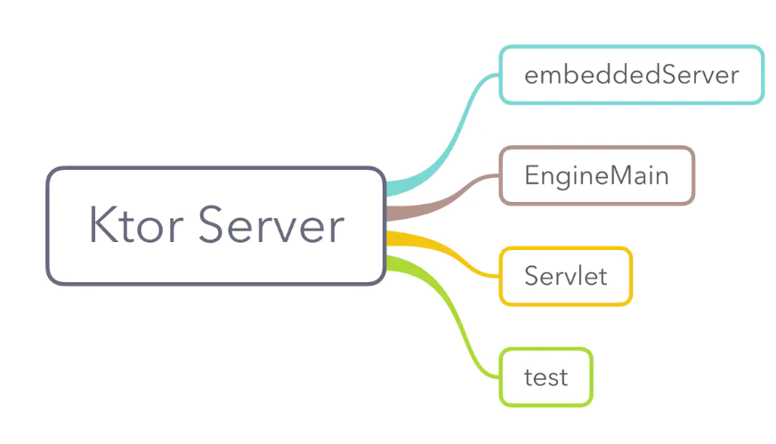

# Ktor-client 学习笔记

## Ktor介绍

Ktor 包含一个多平台异步 HTTP 客户端，它允许您发出请求和处理响应，使用插件扩展其功能，例如身份验证、JSON 序列化等。在本教程中，我们将创建一个简单的客户端应用程序来发送请求和接收响应。

## 添加依赖项
1. 打开工程下的 ***build.gradle*** 文件并添加以下行来指定 Ktor 版本
    ``` kotlin
    ext.versions = [
      'ktor_version': '1.0.0'
    ]
    ```
1. 打开需要用到的module或者app目录的 ***build.gradle*** 添加依赖
    ```kotlin
    dependencies {

    // ktor 网络请求模块
    implementation "io.ktor:ktor-client-core:$ktor_version"
    implementation "io.ktor:ktor-client-cio:$ktor_version"
}
    ```
1. 创建一个


## 三 Ktor 服务端的使用
我们可以通过多种方式运行 Ktor 服务端程序：  

- 在 main() 中调用 embeddedServer 来启动 Ktor 应用
- 运行一个 EngineMain 的 main() 并使用 HOCON application.conf 配置文件
- 作为 Web 服务器中的 Servlet
- 在测试中使用 withTestApplication 来启动 Ktor 应用
### 3.1 Gradle 配置 Ktor
Kotlin 的版本需要 1.3.x，因为 Ktor 底层会依赖到 Kotlin Coroutines。
在需要使用 Ktor 的 module 中添加如下的依赖：
```kotlin
dependencies {
    ...
    implementation "io.ktor:ktor-server-core:${libs.ktor}"
    implementation "io.ktor:ktor-server-netty:${libs.ktor}"
}
```
后面的例子还会介绍 Ktor 其他的 artifact，例如：freemarker、gson 等。
### 3.2 embeddedServer

