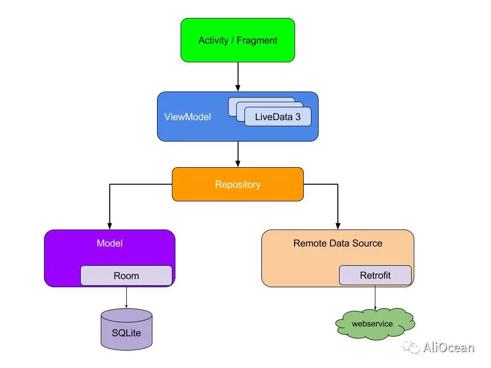
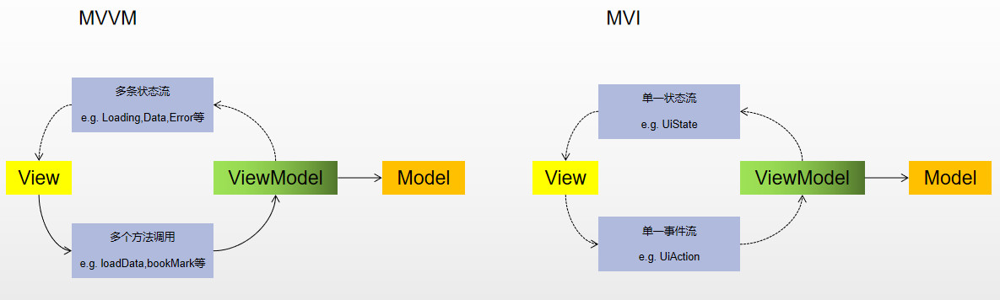
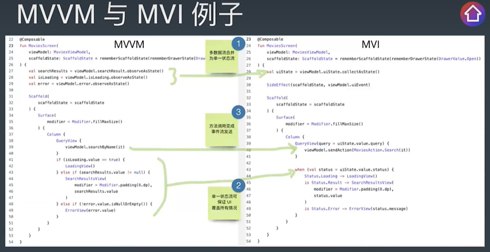
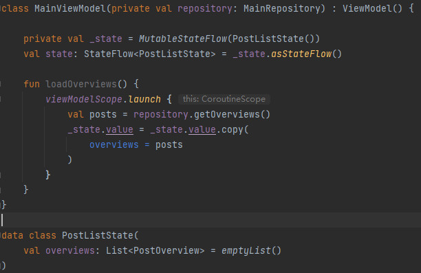
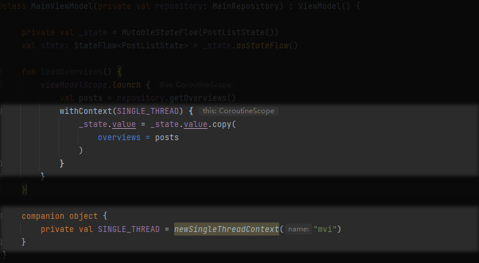
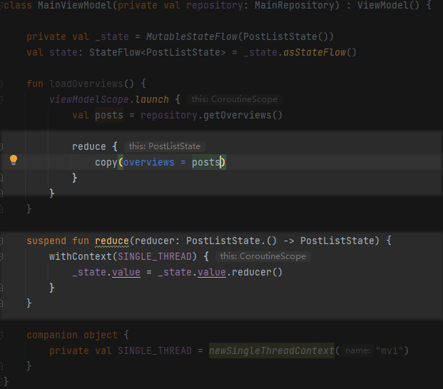
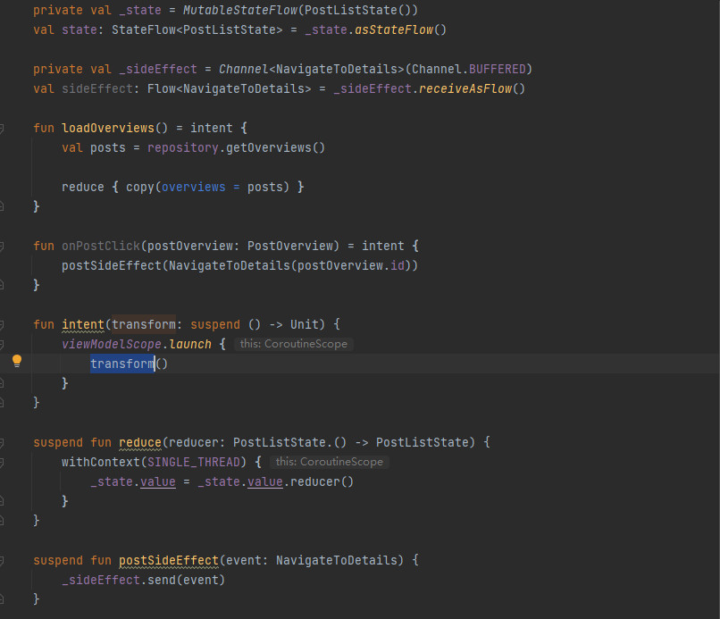

# MVVM
简单描述下MVVM : LiveData + ViewModel



# MVI
* MVI = Model-View-Intent
* MVI强调了单向数据流(Unidirectional data flow)
* 也有人说 MVI = MVVM + Redux





## MVI例子

1. 关于ViewModel部分的code
```Kotlin
class MVIViewModel {
    data class UiState(val name: String)

    private val _uiState = MutableStateFlow(UiState(name = ""))
    val uiState = _uiState.asStateFlow()

    sealed class UiAction {
        class NameChanged(val name: String) : UiAction()
    }

    fun handleAction(uiAction: UiAction) {
        when (uiAction) {
            is UiAction.NameChanged -> {
                _uiState.value = uiState.value.copy(
                    name = uiAction.name
                )
            }
        }
    }
}
```

2. 针对@Composable数据的刷新
```Kotlin
@Composable
fun MVIView(
    viewModel : MVIViewModel = remember { MVIViewModel() }
) {
    val uiState = viewModel.uiSate.collectAsState().value

    Column {
        TextField(value = uiState.name, onValueChanged = {
            viewModel.handleAction(
                MVIViewModel.UiAction.NameChanged(it)
            )
        })
        Text(text = "Hello ${uiState.name}!")
    }

}
```

<br><br>
# 回顾下MVC，MVP，MVVM

## MVC
| M | Model | 数据模型 | |
|-|-|-| - |
| V | View | 视图 | xml布局、Activity、Fragment
| C | Controller | 控件 | 逻辑 Activity、Fragment

> 问题：
* View和Controller的界限不明确，比如Activity既要管理View，也要做逻辑
<br><br>
## MVP
| M | Model | 数据模型 |
|-|-|-|
| V | View | IView | 视图逻辑接口
| P | Presenter | 向导 | 交流中心

> 优点：
* 解耦、职责十分清晰(抽象、接口、面向接口编程、**依赖倒置**)  
* 复用  例如“个人信息”需要提现在‘个人详情页’、‘左边抽屉栏’等  
* 扩展  业务升级  
* 测试  可以对 M V P 分开测试  

> 缺点：
* 接口爆炸 接口的使用，需要定义太多的接口
* 接口升级 后续升级接口，不仅要改接口，同时需要修改都有的实现类

<br>
> 命令式UI
* UI都是实体：    比如通过 new Text()或者findViewById
* 对实体进行操作： textView.setText()、textView.setBackground

> 声明式UI
* 可以理解为许一个愿，比如提供text，然后系统会自动渲染UI
* Compose就是定义一个可被观察到数据，系统就能观察到数据变化
<br><br>

## MVVM
| M | Model | 数据模型 | 
|-|-| - |
| VM | ViewModel | 视图模型 | 
| V  | View | 视图   布局、activity、fragment

> 原理  
* 当View向ViewModel发送指令的时候，ViewModel不会直接回调给View，而是将计算的结果抽象为状态数据存储在一个可观察的容器中，然后View通过观察LiveData或者Flow来刷新UI的状态
* 事件驱动
* 还可以通过DataBiding实现双向数据绑定，使得View的修改可以直接反应在ViewModel上，而ViewModel的修改也可以直接反馈在View上
* MVVM强调双向数据绑定

## MVI
| M | ViewModel | 视图模型 | 可被观测点数据 |
|-|-| ---------------- | - |
| V | View | 视图 | 
| I | Intent | 意图 | 你想干什么，如获取列表数据，获取详情，搜索数据

> 优点
* 单向数据流 有助于溯源
* UiState是唯一刷新点，只有UiState才能改变View
* UiState是唯一的可信数据


## Compose
1. 声明式UI  简单、开发效率高、出错几率小
2. 组合和继承
View ViewGroup ImageView 通过继承来的，View代码已经有三万多行，更新维护成本大
组合的话，就没有这问题，如公司是由员工组成，某一位员工不合适或者离职只需要重新招一个即可
3. 测量方式  
多次测量，消耗性能，  父节点需要先确认子节点宽高，子节点又得先确认孙节点的宽高
compose只需要测量一次，参数限定了min和max的height和weight
<br>
```Kotlin
////////////////////////////////////// View.kt
@Composable
fun NewsItem(viewModel: NewsViewModel, news: News) {
    Card(modifier = Modifier.padding(10.dp), elevation = 10.dp) {
        Row(
            modifier = Modifier
                .fillMaxWidth()
                .height(60.dp)
                .padding(end = 10.dp),
            verticalAlignment = Alignment.CenterVertically,
            horizontalArrangement = Arrangement.SpaceBetween
        ) {
            Image(
                painter = painterResource(id = R.drawable.ic_launcher_foreground),
                contentDescription = null
            )
            Text(text = "${news.title}")
        }
    }
}

@Composable
fun NewsList(viewModel: NewsViewModel) {
    val state = viewModel.uiState

    LaunchedEffect(Unit) {
        viewModel.newsChannel.send(NewsIntent.GetNews)
    }

    LazyColumn(modifier = Modifier.fillMaxSize()) {
        items(state.dataList) { news ->
            NewsItem(viewModel = viewModel, news = news)
        }
    }
}

//////////////////////////////////////// ViewModel.kt
data class News(
    val title: String,
    val content: String
)

data class NewsState(
    val dataList: List<News> = emptyList()
)

// Intent （MVI中的I）
sealed class NewsIntent {
    object GetNews : NewsIntent()
    object GetNewsDetail : NewsIntent()
    object QueryNews : NewsIntent()
}

class NewsViewModel : ViewModel() {

    val newsChannel = Channel<NewsIntent>(Channel.UNLIMITED) // Channel 信道
    var uiState by mutableStateOf(NewsState())


    init {
        handleIntent()
    }

    private fun handleIntent() {
        viewModelScope.launch {
            newsChannel.consumeAsFlow().collect {
                when (it) {
                    is NewsIntent.GetNews -> {
                        getNewsData()
                    }
                    is NewsIntent.GetNewsDetail -> {}
                    is NewsIntent.QueryNews -> {}
                }
            }
        }
    }

    private fun getNewsData() {
        viewModelScope.launch {
            newsFlow.flowOn(Dispatchers.Default)
                .collect { news ->
                    uiState = uiState.copy(news)
                }
        }
    }

    private val newsFlow: Flow<List<News>> = flow {
        val newsList = arrayListOf<News>()
        repeat(30) {
            newsList.add(News("测试标题---$it", ""))
        }
        emit(newsList)
    }
}
```

<br><br>
[只用30行代码，告诉你什么是MVI模式。我劝你放弃MVVM、拒绝MVP](https://www.bilibili.com/video/BV1YV4y1E7x8/?spm_id_from=333.337.search-card.all.click&vd_source=20cabbde393119344cd1f6e12ba51b26)

1. 创建ViewModel，添加 UiState，同时实现loadOverviews功能，更新列表信息

2. 由于复制操作属于耗时的，所以这边做下线程处理

3. 将代码进行缩减  

4. 增加intent方法（mvi），将调用时使用的viewModelScope统一处理。这边还增加了Channel 管道刷新的写法

5. 新增Container类保存状态内容，同时增加范式来提供复用
```Kotlin
class MainViewModel(private val repository: MainRepository) : ViewModel() {

    val container = Container<PostListState, NavigateToDetails>(viewModelScope, PostListState())

    fun loadOverviews() = container.intent {
        val posts = repository.getOverviews()

        reduce { copy(overviews = posts) }
    }

    fun onPostClick(postOverview: PostOverview) = container.intent {
        postSideEffect(NavigateToDetails(postOverview.id))
    }

}

class Container<STATE, SIDE_EFFECT>(
    private val scope: CoroutineScope, initState: STATE
) {

    private val _state = MutableStateFlow(initState)
    val state: StateFlow<STATE> = _state.asStateFlow()

    private val _sideEffect = Channel<SIDE_EFFECT>(Channel.BUFFERED)
    val sideEffect: Flow<SIDE_EFFECT> = _sideEffect.receiveAsFlow()


    fun intent(transform: suspend Container<STATE, SIDE_EFFECT>.() -> Unit) {
        scope.launch {
            this@Container.transform()
        }
    }

    suspend fun reduce(reducer: STATE.() -> STATE) {
        withContext(SINGLE_THREAD) {
            _state.value = _state.value.reducer()
        }
    }

    suspend fun postSideEffect(event: SIDE_EFFECT) {
        _sideEffect.send(event)
    }


    companion object {
        private val SINGLE_THREAD = newSingleThreadContext("mvi")
    }
}

data class PostListState(
    val overviews: List<PostOverview> = emptyList(),
)

data class NavigateToDetails(val postId: Int)
```

